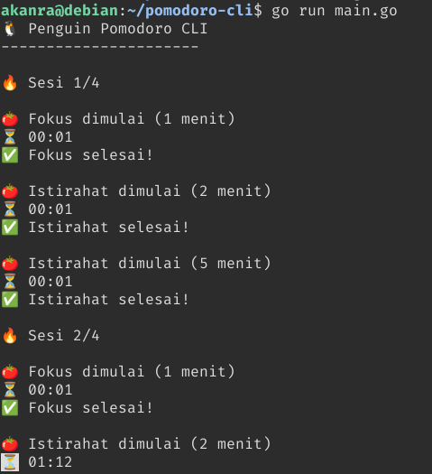
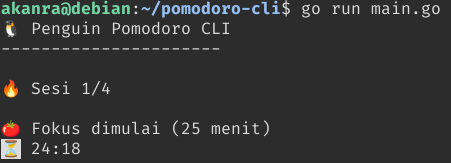

# Penguin Pomodoro CLI 🐧🍅

Simple Pomodoro Timer written in Go.

A lightweight terminal-based Pomodoro timer designed for focus sessions while studying, coding, or learning.

## Features

- 4 Pomodoro sessions
- 25 minutes focus timer
- 5 minutes break timer
- Terminal based
- Lightweight and simple
- Written in Go

## Development

During testing, shorter timers were used:

- Focus: 1 minute
- Break: 2 minutes
- Sessions: 4

This was done to speed up development and verify program behavior.

## Default Configuration

- Focus: 25 minutes
- Break: 5 minutes
- Sessions: 4

## Run

```bash
go run main.go
```

## Example Output

```text
🐧 Penguin Pomodoro CLI
----------------------

🔥 Sesi 1/4

🍅 Fokus dimulai (25 menit)

⏳ 24:59
```

## Screenshot




## Why?

This project was created as a simple Go learning project and a practical CLI tool that anyone can use.

## License

MIT
